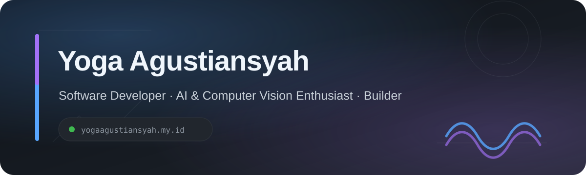

<div align="center">



<br>

<a href="https://yogaagustiansyah.my.id"><strong>Portfolio</strong></a>
&nbsp;&nbsp;·&nbsp;&nbsp;
<a href="https://github.com/yoga220802?tab=repositories"><strong>Repositories</strong></a>
&nbsp;&nbsp;·&nbsp;&nbsp;
<a href="https://github.com/yoga220802"><strong>GitHub</strong></a>

</div>

---

## About Me

I'm **Yoga Agustiansyah**, a software developer interested in building useful products and exploring intelligent systems.

My work and experiments mostly live around **Software Engineering**, **Artificial Intelligence**, **Computer Vision**, modern web development, mobile applications, and backend systems.

```typescript
const yoga = {
  name: "Yoga Agustiansyah",
  username: "yoga220802",
  website: "https://yogaagustiansyah.my.id",

  interests: [
    "Artificial Intelligence",
    "Computer Vision",
    "Natural Language Processing",
    "Software Engineering",
  ],

  languages: ["JavaScript", "TypeScript", "Python", "Go", "Dart"],

  development: {
    frontend: ["React", "Next.js"],
    mobile: ["Flutter", "React Native"],
    backend: ["Node.js", "Express.js", "REST API"],
  },

  mindset: "Build. Learn. Improve. Repeat.",
};
```

---

## Tech & Tools

<table>
<tr>
<td><strong>Languages</strong></td>
<td>JavaScript · TypeScript · Python · Go · Dart</td>
</tr>
<tr>
<td><strong>Frontend</strong></td>
<td>React · Next.js · HTML5 · CSS</td>
</tr>
<tr>
<td><strong>Mobile</strong></td>
<td>Flutter · React Native · Expo</td>
</tr>
<tr>
<td><strong>Backend</strong></td>
<td>Node.js · Express.js · REST API</td>
</tr>
<tr>
<td><strong>Interests</strong></td>
<td>Artificial Intelligence · Computer Vision · NLP · Software Engineering</td>
</tr>
</table>

---

## GitHub Metrics

<div align="center">


<br>


<br>


</div>

> These metrics are generated automatically by GitHub Actions and stored directly in this repository.

---

## Featured Projects

<table>
<tr>
<td width="50%" valign="top">

### [SiCerdas](https://github.com/yoga220802/SiCerdas)

Dart-based project and one of my explorations in application development.

**Primary language:** `Dart`

[Explore repository →](https://github.com/yoga220802/SiCerdas)

</td>
<td width="50%" valign="top">

### [catdoc-ai](https://github.com/yoga220802/catdoc-ai)

TypeScript-based AI application from my exploration of AI-powered software products.

**Primary language:** `TypeScript`

[Explore repository →](https://github.com/yoga220802/catdoc-ai)

</td>
</tr>

<tr>
<td width="50%" valign="top">

### [Covid19-Care](https://github.com/yoga220802/Covid19-Care)

A COVID-19 themed mobile application project built with React Native and Expo.

**Primary language:** `JavaScript`

[Explore repository →](https://github.com/yoga220802/Covid19-Care)

</td>
<td width="50%" valign="top">

### [BackEnd-Kasir-Apotek-JS](https://github.com/yoga220802/BackEnd-Kasir-Apotek-JS)

Express.js backend project for a pharmacy cashier application.

**Stack:** `JavaScript` · `Express.js`

[Explore repository →](https://github.com/yoga220802/BackEnd-Kasir-Apotek-JS)

</td>
</tr>
</table>

<div align="center">

### [View all repositories →](https://github.com/yoga220802?tab=repositories)

</div>

---

## What I'm Exploring

- Intelligent and AI-powered applications
- Computer vision systems
- Modern frontend and full-stack development
- Backend and API architecture
- Mobile application development
- Software architecture and engineering
- Agentic AI and multi-agent systems

---

## Build Philosophy

```text
Idea
 │
 ▼
Research
 │
 ▼
Prototype
 │
 ▼
Build
 │
 ▼
Test & Break Things
 │
 ▼
Learn
 │
 ▼
Improve
 └───────────────↺
```

> The best way to understand technology is to build with it.

---

<div align="center">

### Find me online

**[yogaagustiansyah.my.id](https://yogaagustiansyah.my.id)**

<br>

[GitHub](https://github.com/yoga220802)
&nbsp;&nbsp;·&nbsp;&nbsp;
[Repositories](https://github.com/yoga220802?tab=repositories)
&nbsp;&nbsp;·&nbsp;&nbsp;
[Portfolio](https://yogaagustiansyah.my.id)

<br><br>

<sub>Build things · Stay curious · Keep learning</sub>

</div>
